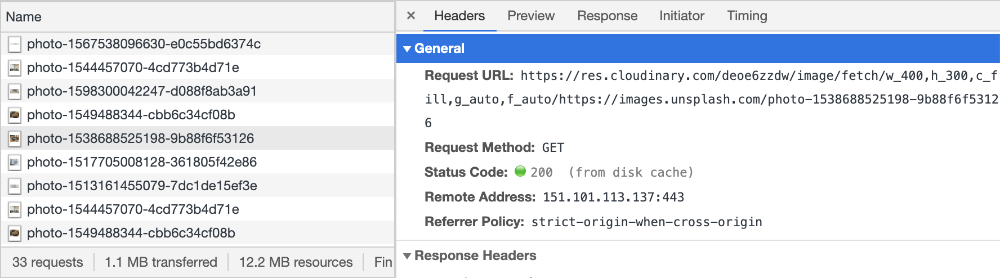
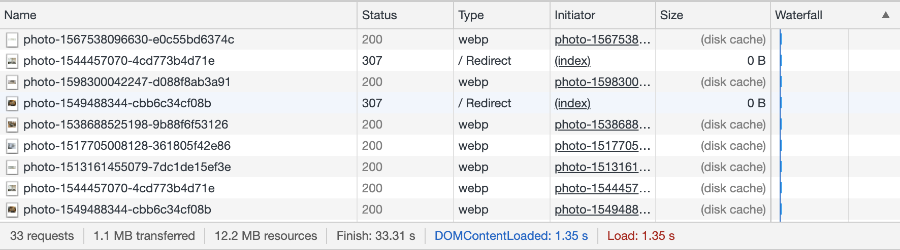
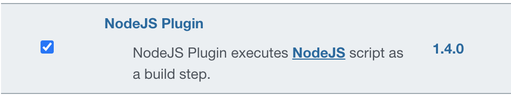

## Tricky parts solved

- image CDN <br>
  Instead of downloading imgs directly from `unsplash.com` an image CDN is used  to serve `*.webp` files  whenever possible and the image in the optimised resolution is downloaded (based on the containers width and legth). Additionally retina displays are taken into consideration.

## Setting up Jenkins

```bash
docker volume create jenkins-data
docker volume create npm-cache
docker volume create cypress-cache
```

```bash
docker run \
   -u root \
   -d \
   --name jenkins \
   -p 8080:8080 \
   -v jenkins-data:/var/jenkins_home \
   -v npm-cache:/root/.npm \
   -v cypress-cache:/root/.cache \
   -v /var/run/docker.sock:/var/run/docker.sock \
   jenkinsci/blueocean:latest
```

and

```bash
docker logs <container id>
```

and copy the administrator password

go to `localhost:8080` and use the password

Create a new user e.g. `jenkins-user`
Go to `http://localhost:8080/pluginManager/`
Install:


Resources:
https://github.com/cypress-io/cypress-example-kitchensink/blob/master/Jenkinsfile
